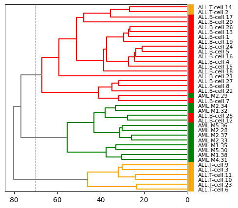
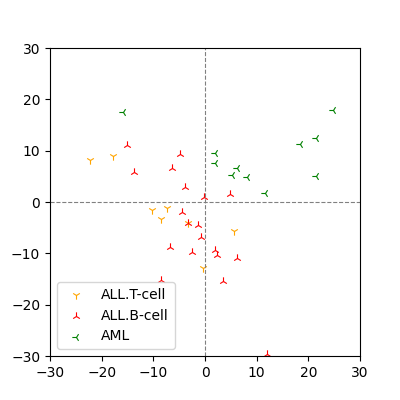

# Hierachical Clustering of Leukemia Gene Expression Dataset

## Introduction

The mechanism of leukemia, as in other cancers, is closely related to gene expressions.
For example, *chronic myelogenous leukemia*, CML is caused by the constant activation of tyrosine kinases due to gene mutations.
Identification of the proteins associated with the disease, the so-called *disease-associated genes* provides a clue to the development of effective drugs for the disease.
In the case of CML, this was the tyrosine kinase inhibitor *imatinib*, an early example of a *molecularly targeted drug*.

In general, when genotypes based on gene expressions share certain features with the patient's phenotypes, these features are considered to be the representation of the disease-associated genes.
Based on this idea, *Golub et al.* proposed in 1999 to classify diseases based on gene expression levels as features[1].

The process of determining the association between gene expressions and phenotypes is essentially *unsupervised* or *self-supervised learning*.
Here, we use one of the basic methods of unsupervised learning, *clustering*, to classify the phenotypes of patients based on gene expression levels.

## Dataset

We use the dataset of *acute lymphocytic leukemia*, ALL and *acute myeloid leukemia*, AML by *Golub et al.*
The dataset is divided into two parts for training and validation; here we use the training set consisting of 7,129 gene expression levels from 27 ALL and 11 AML patients.
In the original dataset, gene expression levels are expressed as integer values, but we treat them as real numbers for later calculations.

We define a $(38 \times 7,129)$-matrix with patients as rows and genes as columns.
Let $x_{i,j} \in \mathbf{R}$ be the expression level of gene $j$ in patient $i$, then the matrix representing the dataset is $[x_{i,j}]$.

More generally, with $m$ as the number of samples and $n$ as the dimension of the features, the entire dataset is denoted by the $(m \times n)$-matrix $X = [x_{i,j}]$.

## Clustering

For the $(m \times n)$-matrix $X = [x_{i,j}]$ representing the dataset, the row $X_i = (x_{i,1}, x_{i,2}, \dots, x_{i, n})$ is the real vector representing the i-th sample with its features.
The distance between vectors can be computed by introducing a *metric* in the vector space $\mathbf{R}^n$, where $X_i$ as an element.
Assuming that vectors closer in distance share more features, we construct the first cluster $C_{m+1}$ from the two vectors in the closest neighborhood.
Here we introduce one of the basic metric, *Euclidean distance*.
```math
d_{\mathrm{Euclid}}(X_i, X_j) = \sqrt{\sum_{k=1}^n (x_{i,k} - x_{j,k})^2}.
```

After constructing the first cluster, the distances between vectors that do not belong to the cluster and the cluster are calculated, and a new cluster $C_{m+2}$ is constructed from the two vectors or the vector and the cluster in the nearest neighborhood.
In this process, we need to define a *linkage* for a set of clusters as an extension of metric for a vector space.

We use the definition by *Ward* for linkage[2].
That is, when we newly construct a cluster $C_i \cup C_j$ from clusters $C_i$ and $C_j$, with $|C_i|$ as the number of elements i.e. vectors in the cluster $C_i$, we define the linkage between $C_i \cup C_j$ and an existing cluster $C_k$ as
```math
d_{\mathrm{Ward}}(C_i \cup C_j, C_k) = \Big\{\frac{|C_i|+|C_k|}{t}d_{\mathrm{Ward}}(C_i, C_k)^2 + \frac{|C_j|+|C_k|}{t}d_{\mathrm{Ward}}(C_j, C_k)^2 - \frac{|C_k|}{t}d_{\mathrm{Ward}}(C_i, C_j)^2\Big\}^{\frac{1}{2}}
```
where $t = |C_i| + |C_j| + |C_k|$.
When the objects of computing linkage are vectors, then $X_i$ and $X_j$ as vectors, we define $|X_i| = 1$, $d_{\mathrm{Ward}}(X_i, X_j) = d_{\mathrm{Euclid}}(X_i, X_j)$, in other words, by considering a vector as the smallest cluster consisting of a single element, we can generalize the metric of vectors and clusters.
In fact, assigning $X_i$ for $C_i$ and $C_j$, $X_j$ for $C_k$ in the definition of Ward linkage,
```math
d_{\mathrm{Ward}}(X_i \cup X_i, X_j) = \Big\{\frac{2}{3}d_{\mathrm{Euclid}}(X_i, X_j)^2 + \frac{2}{3}d_{\mathrm{Euclid}}(X_i, X_j)^2 - \frac {1}{3}d_{\mathrm{Euclid}}(X_i, X_i)^2\Big\}^{\frac{1}{2}} = d_{\mathrm{Euclid}}(X_i, X_j),
```
it can be seen that Ward's definition is a natural extension of the Euclidean distance.

After continuing the *agglomerative* operation of constructing a new cluster from the vectors or clusters in the nearest neighborhood using the linkage, for the $(m-1)$th time we obtain a cluster $C_{2m-1}$ containing all vectors hierarchically.
This is the basic idea and is known as *hierarchical clustering* since the resulting clusters are hierarchical. 

The actual results computed on the *Golub et al.* dataset are shown in Figure 1.
The clustering result can be represented as a *dendrogram* or a *phylogenetic tree* due to its hierarchical structure.



**Figure 1. Dendrogram representation of the results of hierarchical clustering by gene expression levels for each patient.**

If we take three clusters with a threshold distance of 70.0, shown as a dashed line in the Figure 1, we can almost clearly classify the AML T-cell/B-cell and AML phenotypes, despite unsupervised learning without using phenotypes as labels.

## Comparison with a Linear Method

The results of projecting the vector representations of the genotypes into two dimensions using *principal component analysis*, PCA, which is an unsupervised learning as well as hierarchical clustering, are shown in Figure 2.



**Figure 2. Projection of the vectors of genotypes with PCA.**

Although PCA, a linear method, can be used to classify ALL and AML groups, the discrimination between T-cell and B-cell groups of ALL is unclear.

## Implementation in Python

There are several known packages for hierarchical clustering in Python.
Here, we will implement the algorithm using `numpy` to understand the algorithm.

As a data structure required for the calculation, we define a dictionary $C$ that corresponds to the index of a cluster $C_i$ and indicates the number of vectors in the cluster $|C_i|$.
```python
C = dict()
for i in range(X.shape[0]):
    C[i] = 1
```
Since the rows of the dataset $X$ are vectors representing samples, we assign $|X_i| = 1$ as a cluster consisting of a single vector.

We also determine the matrix $D$ that represents the distance or linakge between each cluster containing vectors.
```python
class DistanceMatrix(object):
    def __init__(self):
        self.matrix = dict()

    def __setitem__(self, key, value):
        i, j = key
        if i > j:
            i, j = j, i
        self.matrix[i, j] = value
        
    def __getitem__(self, key):
        i, j = key
        if i == j:
            return 0
        if i > j:
            i, j = j, i
        return self.matrix[i, j]
```
considering that Ward linkage includes Euclidean distances, this matrix $D$ can be thought of as a *distance matrix* between clusters.
At first, the distance matrix $D$ is created as a square matrix of order $m$ representing the distances for all vector combinations in the dataset $X$.
Let $d_{i,j}$ be the Euclidean distance of the vectors $X_i$ and $X_j$, then $D = [d_{i,j}]$.
Since $D$ is a real symmetric matrix and its diagonal components are zero, we only need to compute it when $i < j$.
```python
euclidean = lambda x, y: np.sqrt(np.sum((x - y)*(x - y)))

D = DistanceMatrix()
for i in range(X.shape[0]):
    for j in range(X.shape[0]):
        if i < j:
            D[i, j] = euclidean(X[i, :], X[j, :])
```

Create a new cluster from the vectors and clusters with the closest distances contained in this $D$, calculate the distances between the new cluster and the other clusters, and add them to $D$.
The cluster containing all vectors is $C_{2m-1}$, and $D$ is then a square matrix of order $(2m-1)$.
```python
for k in range(X.shape[0] - 1):
    # Find the two clusters in the closest neighborhood.
    minimum = np.Infinity
    for i in C.keys():
        for j in C.keys():
            if i < j and D[i, j] < minimum:
                minimum = D[i, j]
                x, y = i, j

    # Create the new cluster from x and y.
    C[X.shape[0] + k] = C[x] + C[y]

    # Update the distance matrix.
    for i in C.keys():
        if i < X.shape[0] + k:
            D[i, X.shape[0] + k] = ward(x, y, i, D, C)
    
    # Clusters x and y are included in the new cluster.
    del C[x], C[y]
```

## References

- [1] T.R. Golub et al., *Molecular Classification of Cancer: Class Discovery and Class Prediction by Gene Expression Monitoring*, **Science**, 286(5439):pp531-7, 15 Oct 1999.
- [2] J.H. Ward, *Hierarchical Grouping to Optimize an Objective Function*, **J Am Stat Assoc**, 58, 236–244, 1963.
