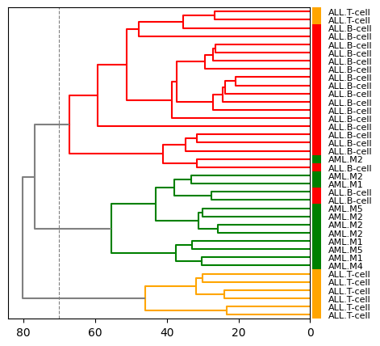

# Hierachical Clustering of Leukemia by Genotypes

## Introduction

The mechanism of leukemia, as in other cancers, is closely related to gene expression levels. For example, *chronic myelogenous leukemia*, CML is caused by the constant activation of a tyrosine kinase due to gene mutations. Identification of the proteins associated with the disease, or *disease-associated genes*, provides clues to the development of effective drugs for the disease. In the case of CML, it led the tyrosine kinase inhibitor `imatinib`, an early example of a *molecular targeted drug*.

In general, when a *genotype* based on gene expression levels shares certain features with a patient's *phenotype*, that characteristics are considered to be the disease-associated genes. Based on this idea, in 1999, *Golub et al*. proposed to classify diseases based on genotype as features[^Golub].

The process of determining the association between genotypes and phenotypes is essentially a *unsupervised learning*, or more recently, *self-supervised learning*. Here we use one of the basic methods of unsupervised learning *clustering* to classify the phenotypes of patients based on genotypes.

## Dataset

We use the dataset of *acute lymphocytic leukemia*, ALL and *acute myeloid leukemia*, AML by Golub et al[^Golub]. Here we use the training set consisting of 7,129 gene expression levels from 27 ALL and 11 AML patients.

We define a $(38 \times 7,129)$-matrix with patients as rows and genes as columns. Let $x_{i,j} \in \mathbf{R}$ be the gene expression level of gene $j$ in patient $i$, then the matrix representing the dataset is $[x_{i,j}]$.

## Hierarchical Clustering

### Algorithm

More generally, for the $(m \times n)$-matrix $X = [x_{i,j}]$ representing the dataset, the row $X_i = (x_{i,1}, x_{i,2}, \dots, x_{i, n})$ is a real vector representing the i-th sample with the features. Here we introduce *metric* to compute the distance between the vectors in the vector space $\mathbf{R}^n$ with $X_i$ as an element. Assuming that vectors closer in distance share more features, we construct the first cluster $C_{m+1}$ from the two closest vectors. In this case, we introduce one of the basic metric, *Euclidean distance*.

```math
d_{\mathrm{Euclid}}(X_i, X_j) = \sqrt{\sum_{k=1}^n (x_{i,k} - x_{j,k})^2}.
```

After constructing the first cluster, the distance between each vector that does not belong to the cluster and the cluster is calculated, and a new cluster $C_{m+2}$ is constructed from the two vectors or the vector and the cluster in the nearest neighborhood. In this process, we need to define *linkage* for the set of clusters as an extension of metric for vector spaces.

We use the definition by *Ward* as the linkage[^Ward]. That is, when we newly construct a cluster $C_i \cup C_j$ from the clusters $C_i$ and $C_j$ with $|C_i|$ as the number of elements or vectors in the cluster $C_i$, the linkage between the new cluster and the existing cluster $C_k$ is defined as

```math
d_{\mathrm{Ward}}(C_i \cup C_j, C_k) = \Big\{\frac{|C_i|+|C_k|}{t}d_{\mathrm{Ward}}(C_i, C_k)^2 + \frac{|C_j|+|C_k|}{t}d_{\mathrm{Ward}}(C_j, C_k)^2 - \frac{|C_k|}{t}d_{\mathrm{Ward}}(C_i, C_j)^2\Big\}^{\frac{1}{2}}
```

where $t = |C_i| + |C_j| + |C_k|$. When the objects of computing linkage are vectors, we define $|X_i| = 1$, $d_{\mathrm{Ward}}(X_i, X_j) = d_{\mathrm{Euclid}}(X_i, X_j)$ for vectors $X_i$ and $X_j$. In other words, we can generalize the metric of vectors and clusters by considering a vector as the smallest cluster consisting of a single element. In fact, assigning $X_i$ for $C_i$ and $C_j$, $X_j$ for $C_k$ in the definition of Ward linkage,

```math
d_{\mathrm{Ward}}(X_i \cup X_i, X_j) = \Big\{\frac{2}{3}d_{\mathrm{Euclid}}(X_i, X_j)^2 + \frac{2}{3}d_{\mathrm{Euclid}}(X_i, X_j)^2 - \frac {1}{3}d_{\mathrm{Euclid}}(X_i, X_i)^2\Big\}^{\frac{1}{2}} = d_{\mathrm{Euclid}}(X_i, X_j),
```

We see that the definition of Ward linkage is a natural extension of the Euclidean distance.

Continuing the operation of constructing a new cluster from the vectors or clusters in the nearest neighborhood using the metric and the linkage in this way, we obtain a cluster $C_{2m-1}$ that hierarchically contains all vectors for the $(m-1)$th time. This is the basic algorithm of *hierarchical clustering*.

### Implementation in Python

Here we will implement the algorithm using `numpy` to understand the algorithm.

First we define a dictionary $C$ that keeps the number $|C_i|$ of vectors in the cluster $C_i$. We assign $|X_i| = 1$ for a single vector.

```python
C = dict()
for i in range(X.shape[0]):
    C[i] = 1
```

We also determine the matrix $D$ that holds the distance or linakge between each cluster containing vectors.

```python
class DistanceMatrix(object):
    def __init__(self):
        self.matrix = dict()

    def __setitem__(self, key, value):
        i, j = key
        if i > j:
            i, j = j, i
        self.matrix[i, j] = value
        
    def __getitem__(self, key):
        i, j = key
        if i == j:
            return 0
        if i > j:
            i, j = j, i
        return self.matrix[i, j]
```

Identifying Euclidean distance and Ward linkage, this matrix $D$ can be thought of as a *distance matrix* between clusters. This distance matrix $D$ is first constructed as a square matrix of order $m$ that is a combination of all vectors in the dataset $X$. Let $d_{i,j}$ be the Euclidean distance of the vectors $X_i$ and $X_j$, then $D = [d_{i,j}]$. Since $D$ is a real symmetric matrix with zero diagonal components, we only need to calculate it when $i < j$.

```python
D = DistanceMatrix()
for i in range(X.shape[0]):
    for j in range(X.shape[0]):
        if i < j:
            D[i, j] = euclidean(X[i, :], X[j, :])
```

Create a new cluster from the closest vectors and clusters in $D$, and calculate the distances between the new cluster and the other clusters and add them to $D$. The cluster containing all vectors is $C_{2m-1}$, where $D$ is a square matrix of order $(2m-1)$.

```python
for k in range(X.shape[0] - 1):
    # Find the two clusters in the closest neighborhood.
    minimum = np.Infinity
    for i in C.keys():
        for j in C.keys():
            if i < j and D[i, j] < minimum:
                minimum = D[i, j]
                x, y = i, j

    # Create a new cluster from x and y.
    C[X.shape[0] + k] = C[x] + C[y]

    # Update the distance matrix.
    for i in C.keys():
        if i < X.shape[0] + k:
            D[i, X.shape[0] + k] = ward(x, y, i, D, C)
    
    # Clusters x and y are included in the new cluster.
    del C[x], C[y]
```

### Classification of Phenotypes by Genotypes

The actual results computed on the *Golub et al.* dataset are shown in Figure 1.
The clustering result can be represented as a *dendrogram* or a *phylogenetic tree* due to its hierarchical structure.



**Figure 1. Dendrogram representation of the results of hierarchical clustering by gene expression levels for each patient.**

If we take three clusters with a threshold distance of 70.0, shown as a dashed line in the Figure 1, we can almost clearly classify the AML T-cell/B-cell and AML phenotypes, despite unsupervised learning without using phenotypes as labels.

### Comparison with a Linear Method

The results of projecting the vector representations of the genotypes into two dimensions using *principal component analysis*, PCA, which is an unsupervised learning as well as hierarchical clustering, are shown in Figure 2.


**Figure 2. Projection of the vectors of genotypes with PCA.**

Although PCA, a linear method, can be used to classify ALL and AML groups, the discrimination between T-cell and B-cell groups of ALL is unclear.

[^Golub]: T.R. Golub et al., *Molecular Classification of Cancer: Class Discovery and Class Prediction by Gene Expression Monitoring*, **Science**, 286(5439):pp531-7, 15 Oct 1999.
[^Ward]: J.H. Ward, *Hierarchical Grouping to Optimize an Objective Function*, **J Am Stat Assoc**, 58, 236–244, 1963.
